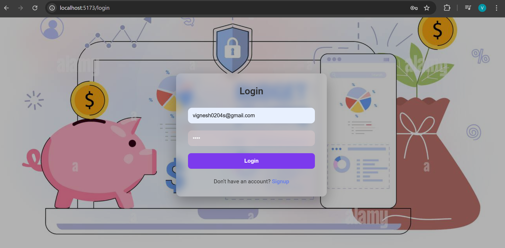
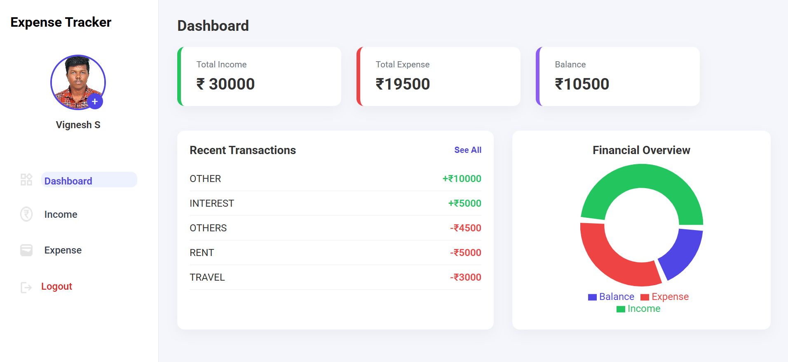
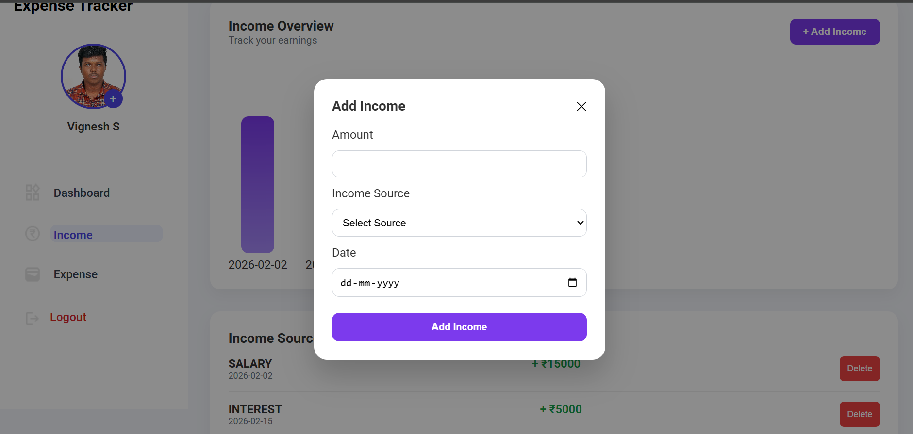
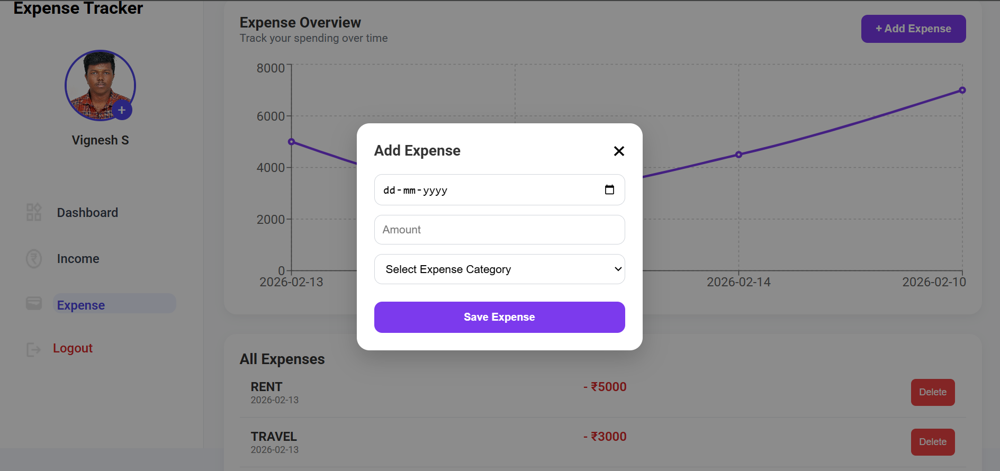
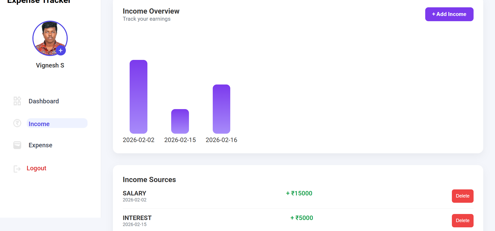
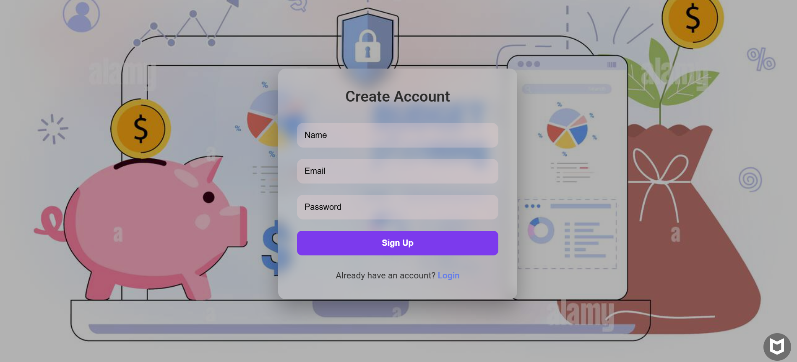

💰 Expense Tracker – Full Stack Application

A full-stack Expense Tracker web application built using React (Frontend) and Spring Boot (Backend) with MySQL database.

This project allows users to register, login, track income & expenses, visualize spending trends, and manage transactions securely.

🚀 Tech Stack

🔹 Frontend

React (Vite)

React Router

Axios

Recharts (Charts)

CSS3

🔹 Backend

Spring Boot

Spring Security (Basic Config)

JPA / Hibernate

MySQL

REST APIs

🔹 Database

MySQL

✨ Features
🔐 Authentication

User Signup

User Login

Protected Routes

Session handled using localStorage (userId based)

💵 Transactions

Add Income

Add Expense

Delete Transaction

View All Transactions

Dashboard Summary (Total Income, Expense, Balance)

📊 Analytics

Line Chart for Expense Overview

Real-time Dashboard Summary

## 📸 Project Screenshots

### 🔐 Login Page

### 📊 Dashboard

### 💰 Add Income

### 💸 Add Expense

### 📄 Income List

### 📄 Expense List

### 📝 Signup Page

